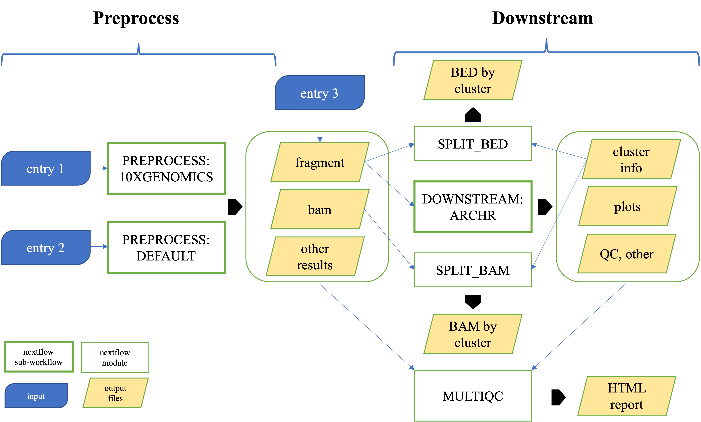

# 

## Introduction

**scATACpipe** is a bioinformatic pipeline for single-cell ATAC-seq (scATAC-seq) data analysis.

The pipeline is built using [Nextflow](https://www.nextflow.io), a workflow tool to run tasks across multiple compute infrastructures in a very portable manner. It uses Docker / Singularity containers making installation trivial and results highly reproducible.

The development of the pipeline is guided by  [nf-core TEMPLATE](https://github.com/nf-core/tools/tree/master/nf_core/pipeline-template).

## Pipeline summary

The pipeline consists of 3 sub-workflows: PREPROCESS_DEFAULT, PREPROCESS_10XGENOMICS, and DOWNSTREAM, which is illustrated below:


**PREPROCESS_DEFAULT:**
1. Prepare fastq input
2. Add barcode to reads
3. Correct barcodes
4. Trim reads
4. Mapping
5. Quality control
6. Filter BAM
7. Remove PCR duplicates
8. Generate fragment file, *etc.*

**PREPROCESS_10XGENOMICS:**
1. Prepare fastq input
2. Prepare index if not supplied
3. Run `cellranger_atac count` command

**DOWNSTREAM:**
1. Perform most ArchR functions and generate various plots
2. Build ArchR genome if not supported natively by ArchR

The pipeline also splits BED and/or BAM files according to ArchR clusterings and summarizes all results into a single MultiQC report for easy access.

## Quick Start

1. Install [`nextflow`](https://nf-co.re/usage/installation)(>=21.06.0).
2. Install either [`Docker`](https://docs.docker.com/engine/installation/) or [`Singularity`](https://www.sylabs.io/guides/3.0/user-guide/) for full pipeline reproducibility. Please specify `-profile singularity` or `-profile docker` when running the pipeline, otherwise, the default `local` will be used that instructs the pipeline to be executed locally expecting all software dependencies to be installed and are on the PATH. **This is not recommended!**
3. Download the pipeline:
```bash
git clone https://github.com/hukai916/scATACpipe.git
```
4. Download a minimal test dataset:
```bash
cd scATACpipe
wget https://www.dropbox.com/s/melktgtd2lb1yrt/test_data1.zip
unzip test_data1.zip
```
  The **test_data1** is prepared by downsampling (5% and 10%) a dataset named "*500 Peripheral blood mononuclear cells (PBMCs) from a healthy donor (Next GEM v1.1)*" provided by [10xgenomics](https://www.10xgenomics.com/resources/datasets?query=&page=1&configure%5Bfacets%5D%5B0%5D=chemistryVersionAndThroughput&configure%5Bfacets%5D%5B1%5D=pipeline.version&configure%5BhitsPerPage%5D=500&menu%5Bproducts.name%5D=Single%20Cell%20ATAC). Note that, in test_data1, I1 refers to index1, which is for sample demultiplexing and not relevant to our case; R1 refers to Read1; **R2 refers to index2**, which represents the cell barcode fastq; R3 refers to Read2.
5. Edit the `replace_with_full_path` in the assets/sample_sheet_test_data1.csv to use **full path**.
6. Test the pipeline on this minimal test_data1:

  **with Docker:**
```bash
nextflow run main.nf -profile docker --outdir res_test_data1 --input_preprocess assets/sample_sheet_test_data1.csv --preprocess default --ref_fasta_ucsc hg19 --mapper bwa --barcode_whitelist assets/barcode/737K-cratac-v1.txt.gz
```
* By default, the `local` [executor](https://www.nextflow.io/docs/latest/executor.html) will be used. This can be configured with `-profile` flag.
* Please check [nf-core/configs](https://github.com/nf-core/configs#documentation) to see what other custom config files can be supplied.

  **with Singularity:**
```bash
nextflow run main.nf -profile singularity,lsf --outdir res_test_data1 --input_preprocess assets/sample_sheet_test_data1.csv --preprocess default --ref_fasta_ucsc hg19 --mapper bwa --barcode_whitelist assets/barcode/737K-cratac-v1.txt.gz
```
* By specifying `-profile lsf`, the `lsf` executor will be used for job submission.
* If you are using `singularity`, then the pipeline will automatically pull and convert the Docker images. By default, the downloaded images will be saved to `work/singularity` directory. It is highly recommended to use the [`NXF_SINGULARITY_CACHEDIR` or `singularity.cacheDir`](https://www.nextflow.io/docs/latest/singularity.html?#singularity-docker-hub) settings to store the images in a central location for future pipeline runs.
7. Start running your own analysis:
* for help info:
```bash
nextflow run main.nf --help
```
* for a typical command:
```bash
nextflow run main.nf -profile <singularity/docker/lsf> --input_preprocess <path_to_samplesheet> --preprocess <default/10xgenomics> --outdir <path_to_result_dir> --ref_fasta_ucsc <UCSC_genome_name> --mapper <bwa/minimap2> --barcode_whitelist <path_to_barcode>
```

See documentation [usage](https://github.com/hukai916/scATACpipe/docs/usage.md) for all of the available options when running the pipeline.

## Documentation

The scATACpipe workflow comes with documentation about the pipeline: [usage](https://github.com/hukai916/scATACpipe/docs/usage.md) and [output](https://github.com/hukai916/scATACpipe/docs/output.md).

## Credits

scATACpipe was originally designed and written by Kai Hu, Haibo Liu, and Julie Lihua Zhu.

We thank the following people for their extensive assistance in the development
of this pipeline: Nathan Lawson.

## Support

For further info, help, or feature requests, the developers would prefer that you open up a new GitHub issue by clicking [here](https://github.com/hukai916/scATACpipe/issues/new/choose).
If you would like to extend the functionalities of scATACpipe for your own good, you can choose to fork the repo.

## Citations
<!-- TODO If you use scATACpipe for your analysis, please cite it using the following doi: [](https://) -->
Please kindly cite scATACpipe [to be added] if you use it for your analysis.

An extensive list of references for the tools used by the pipeline can be found [here](https://github.com/hukai916/scATACpipe/docs/module_software.xlsx). Please consider citing them too.
